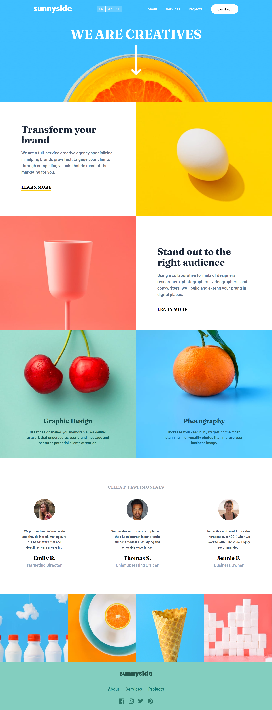

# Sunnyside Landing Page - Frontend Mentor Junior Challenge

## Description

This is a junior Frontend Mentor challenge of a "Landing Homepage". The main focus of this project was creating a responsive nav bar that toggles open/closed on smaller screens and proper use of CSS for a responsive layout. Furthermore, I challenged myself to add multi-language functionality in English, Spanish, and Japanese. This was made using HTML, SCSS, TailwindCSS, Javascript, and Vite.

## Screenshots

### Desktop View

### Mobile View

## Getting Started

### Prerequisites

This project uses TailwindCSS and SCSS for styling, Typescript for functionality, and Vite for building and serving. Make sure you have [Node.js](https://nodejs.org/) installed on your machine, as it's required to run Vite.

### Installation

1. Clone this repository to your local machine or download the files as a zip.
2. Navigate to the project directory.
3. Run `npm install` to install the project dependencies, including Vite.
4. Run `npm run dev` to start the Vite development server. This will also automatically open the project in your default web browser.

## Usage

This project does have interactive features but it is mainly viewed as a static HTML and SCSS project. To view the project, simply run `npm run dev` in the project directory. This will start the Vite development server and open the project in your web browser.

If you want to build the project for production, run `npm run build`. This will create a `dist` directory with the built files.

## Contributing

This project is a simple practice project and is not currently accepting contributions.

## License

This project is licensed under the MIT License - see the `LICENSE.md` file for details.

## Contact

For any questions or concerns, please contact Juan Lagunas at dev.jlagunas@gmail.com.
